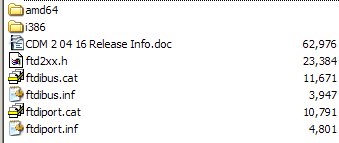
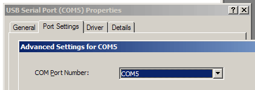
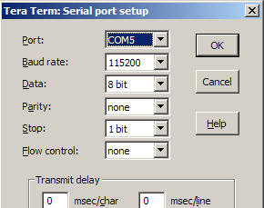
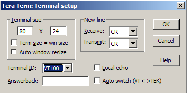

# Quick Setup

### Windows

## FTDI driver install and configuration {#ftdi_driver_install_and_configuration}

Windows will request a driver the first time the Bus Pirate connects to
a PC. Extract the 2.08.28 [virtual com port drivers from
FTDI](http://www.ftdichip.com/Drivers/VCP.htm) into a folder and browse
to them using the \'Found New Hardware\' wizard. Note: the 2.08.30
drivers gave some people connection errors between the Windows terminal
and the Bus Pirate. For now we advise to install the 2.08.28 drivers.
Install guides and drivers for other systems are also available on the
FTDI driver download page.

To find the COM port number assigned to the Bus Pirate go to the Windows
device manager (*Start-\>Settings-\>Control
panel-\>System-\>Hardware-\>Device manager*). Look in \'Ports (COM &
LPT)\' for \'USB Serial Port\', ours is COM5.

You can change the serial port assigned to the FTDI chip. Go to *USB
Serial Port properties-\>Port settings tab-\>Advanced*, change the COM

## Install Terminal Software

Windows terminal is cranky, but [it appears to
work](http://whereisian.com/forum/index.php?topic=4.0) with the Bus
Pirate when VT100 emulation is enabled. We highly recommend a better
terminal, we like [Tera Term Pro](http://www.ayera.com/teraterm/) for
Windows.

First, configure the correct COM port and settings. The Bus Pirate
operates at 115200bps/8/N/1 on the COM port assigned by Windows.
*Flow control is no longer required. Disable it!*

Next, check the terminal setup. Turn off local echo and use a VT100
terminal type. The Bus Pirate should work with any type of new-line
character, but we use the CR setting.

### Mac
### Linux

Notes on using Bus Pirate v3 with [Fedora 14
x86_64](http://fedoraproject.org/). It is meant to be terse, the forum
and wiki have all the info needed, there was just no search result for
Fedora and if I ever need to re-do the setup, it will be nice to have
all the parts in one post.

1\. As long as RHBZ Bug 663124 is not fixed, use the work-around from
Comment #1 in that bug. This means adding a line to
`/etc/sysconfig/gpsd` to prevent gpsd from attaching to the BP:

`USBAUTO=no`

2\. Add this to udev rules (one line)

`SUBSYSTEM=="tty", ATTRS{idVendor}=="0403", ATTRS{idProduct}=="6001", ATTRS{serial}=="12345678", MODE="0660", SYMLINK+="buspirate"`

Obviously, instead of 12345678 you need to use the serial number of your
BP. Find it with:

`# dmesg | grep -A 5 -B 5 SerialNumber`

after plugging in the BP.

3\. configure minicom with `minicom -s buspirate` to end up with
`/etc/minirc.buspirate` as follows:

    # Machine-generated file - use "minicom -s" to change parameters.
    pu port /dev/buspirate
    pu minit ?^M
    pu mreset ^M
    pu mdialpre
    pu mdialsuf
    pu mdialpre2
    pu mdialsuf2
    pu mdialpre3
    pu mdialsuf3
    pu rtscts No

The initstring used has the advantage that I get BP\'s help output on
connect.

4\. Use the BP (ideally not as root, just have your user in the right
group or play with the MODE in the udev rule):

`$ minicom buspirate`

Source:
[pcfe](http://dangerousprototypes.com/forum/viewtopic.php?f=4&t=1854#p17966).

### Android

## Plug in the Bus Pirate

## Connect to the Bus Pirate

