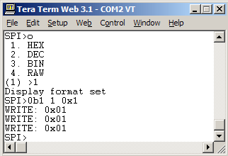

# Number Formats

### Number entry and formats {#number_entry_and_formats}

Numbers can be entered as
[binary](http://en.wikipedia.org/wiki/Binary_numeral_system),
[decimal](http://en.wikipedia.org/wiki/Decimal), or
[hexadecimal](http://en.wikipedia.org/wiki/Hexadecimal) values, mix and
match, use whatever best suits the datasheet or task.
`<nl2br>`{=html}I2C\>=
``{=html}**\<\<\<convert
number formats**``{=html} CONVERT (1) \>10
``{=html}**\<\<\<enter value
in any format**``{=html} 0x0A 10 0b00001010
I2C\>`</nl2br>`{=html} Use the \'=\' menu to convert between formats.
Decimal 10 is equivalent to 0x0a (HEX) and 0b1010 (BIN). [More about the
value
converter](http://dangerousprototypes.com/2009/08/27/bus-pirate-hexdecbin-converter).
`<nl2br>`{=html}CONVERT (1) \>0x0f 0x0F 15 0b00001111`</nl2br>`{=html}
0x0f is a HEX formatted value. The leading 0 is optional for values less
than 0x10, 0xf is also valid. HEX can also be entered as 0h0f, if
that\'s more familiar. `<nl2br>`{=html}CONVERT (1) \>0b11 0x03 3
0b00000011`</nl2br>`{=html} 0b11 is a binary 3. It can also be entered
with or without leading 0s: 0b00000011, 0b011, etc. [More about number
entry and output
display](HEX/DEC/BIN_number_entry_and_output_display "wikilink").

### Repeat command {#repeat_command}

Most syntax can be repeated by appending \':\' and a repeat value, the
repeat value can be in any number format. `<nl2br>`{=html}I2C\>0b10:0x03
WRITE: 0x02 , 0x03 TIMES ACK
``{=html}**\<\<\<\'0b10\'
three times**``{=html} I2C\>`</nl2br>`{=html} 0b10:0x03 uses the
repeat command(:) to write 2 (0b10) to the I2C bus three times (:0x03).
`<nl2br>`{=html}I2C\>\[0xa1 r r r:3\] I2C START BIT WRITE: 0xA1 ACK
READ: 0x0F
ACK``{=html}**\<\<\< read a
single byte**``{=html} READ: 0x0E
ACK``{=html}**\<\<\< read a
single byte**``{=html} READ 0x03
BYTES:``{=html}**\<\<\< read
multiple bytes**``{=html} 0x03 ACK 0x0E ACK 0x02 NACK I2C STOP
BIT I2C\>`</nl2br>`{=html} r is the generic command to read a single
byte in all bus modes, it can also be repeated with the \':\' command
(r:3). The Bus Pirate output is HEX formatted by default, but you can
change it to binary or decimal from the output mode menu \'o\'.

### When you\'re done {#when_youre_done}

`<nl2br>`{=html}I2C\>m``{=html}**\<\<\<mode
menu**``{=html} 1. HiZ \... 10. LCD (1)
\>``{=html}**\<\<\<HiZ is the
default**``{=html} Mode selected HiZ\>`</nl2br>`{=html} When
you\'re done, press \'m\'. The Bus Pirate immediately turns off all
outputs, power supplies, and pull-up resistors, and prompts for a new
mode. Choose 1 (or just press enter for the default option) to return to
HiZ mode.

## Entry

The Bus Pirate terminal interface accepts numbers in three formats:
[hexadecimal](http://en.wikipedia.org/wiki/Hexadecimal),
[decimal](http://en.wikipedia.org/wiki/Decimal), and
[binary](http://en.wikipedia.org/wiki/Binary_numeral_system). It also
displays values in HEX/DEC/BIN and a raw byte format. This short guide
explains how to enter number values into the Bus Pirate, and how to
adjust the Bus Pirate number display format.

## Number entry {#number_entry}

The maximum value you can enter in any format is currently 255
(8bits/1byte).

### Decimal

0, 24, 74, 255

### Hexadecimal

0x0, 0x18, 0x4A, 0xFF

[Hexadecimal](http://en.wikipedia.org/wiki/Hexadecimal) values are base
16 numbers that use a-f for the numbers 10-15, this format is very
common in computers and electronics. Enter HEX values as shown above,
precede the value with 0x. Single digit numbers don\'t need 0 padding,
0x01 and 0x1 are interpreted the same.

### Binary

0b0, 0b11000, 0b1001010, 0b11111111

[Binary](http://en.wikipedia.org/wiki/Binary_numeral_system) values are
commonly used in electronics because the 1\'s and 0\'s correspond to
register \'switches\' that control various aspects of a device. Enter a
binary number as 0b and then the bits. Padding 0\'s are not required,
0b00000001=0b1.

## Convert formats {#convert_formats}

`<nl2br>`{=html}2WIRE\> =0b110 0x06 = 6 = 0b00000110 2WIRE\> =0xa 0x0A =
10 = 0b00001010 2WIRE\> =12 0x0C = 12 = 0b00001100
2WIRE\>`</nl2br>`{=html} The [=
command](Bus_Pirate_menu_options_guide#.3DX_Convert_X_to_HEX.2FDEC.2FBIN_number_format "wikilink")
(firmware v2.1+) converts between number formats.

## Display

`<nl2br>`{=html}HiZ\>o 1. HEX 2. DEC 3. BIN 4. RAW (1) \>1 Display
format set HiZ\>`</nl2br>`{=html} The Bus Pirate terminal will display
values in BIN/HEX/DEC. Change the setting in the data display format
menu (o). The default display format is HEX.

The RAW display mode sends values to the terminal as raw byte values
without any text conversion. This is useful for bus sniffers and other
high-speed functions where converting raw bytes to text takes too much
time. Adjust the display format in your serial terminal to see the raw
values as HEX/DEC/BIN.

### Auto Mode
