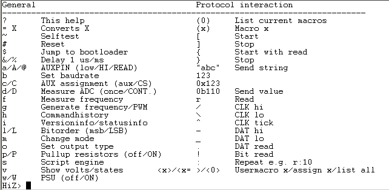

# Command Reference

### User terminal mode {#user_terminal_mode}

The Bus Pirate is accessed from a command line in a serial terminal. The
Bus Pirate always starts in high impedance mode (Hi-Z), a safe mode with
all outputs disabled. It\'s intended to protect any connected devices
from conditions beyond their specifications. From there, a bus mode can
be selected to use the Bus Pirate with a specific protocol.

Talk to the Bus Pirate from a serial terminal set to 115200bps, 8/N/1.
`<nl2br>`{=html}\* Syntax error, type ? for help HiZ\>`</nl2br>`{=html}
Press enter to show the command prompt if your terminal is blank.
`<nl2br>`{=html}HiZ\>m **\<\<\<set mode command** 1. HiZ \... 10. LCD
(1) \>**\<\<\<press enter to select default option (1)** Mode selected
HiZ\>`</nl2br>`{=html}

Most configuration and option prompts have a default value shown in ().
Press enter to select the default option.

### Configuration Menus {#configuration_menus}

Menu options are single character commands that configure the Bus
Pirate. Type a letter, followed by \<enter\>, to access the menu. Some
options are unavailable in some modes and on some hardware. See the [Bus
Pirate menu options guide](Bus_Pirate_menu_options_guide "wikilink") for
detailed explanations.

### Bus Interaction Syntax {#bus_interaction_syntax}

A simple syntax is used to interact with chips. Syntax characters have
the same general function in each bus mode, such as \'R\' to read a byte
of data.

\[0x31 r:5\]

This example syntax sends a bus start , the value 0x31, and then reads 5
bytes, followed by bus stop. Up to 255 characters of syntax may be
entered into the Bus Pirate terminal at once, press enter to execute the
syntax.

### Macros

`<nl2br>`{=html}I2C\>(0) 0.Macro menu 1.7bit address search 2.I2C
sniffer I2C\>(1)`</nl2br>`{=html} Macros perform complex actions, like
scanning for I2C addresses, interrogating a smart card, or probing a
JTAG chain. Macros are numbers entered inside (). Macro (0) always
displays a list of macros available in the current bus mode.

### Terminal Control {#terminal_control}

The Bus Pirate understands some VT-100 (ANSI C0) terminal emulation.

| Keyboard Key  | Ctrl-Key | Action                                                                                             |
|---------------|----------|----------------------------------------------------------------------------------------------------|
| [left arrow]  | ^B       | Moves the cursor left one character                                                                |
| [right arrow] | ^F       | Moves the cursor right one character                                                               |
| [up arrow]    | ^P       | Copies the previous command in the command history buffer to the command line                      |
| [down arrow]  | ^N       | Copies the next command in the command history buffer to the command line                          |
|               | ^A       | Moves the cursor to the beginning of the line                                                      |
|               | ^E       | Moves the cursor to the end of the line                                                            |
| [backspace]   | ^H       | Erases the character to the left of the cursor and moves the cursor left one character             |
| [delete]      | ^D       | Erases the character under (or to the right of) the cursor and moves the cursor left one character |

For more information see [this
thread](http://dangerousprototypes.com/forum/index.php?topic=1036.0) in
the Bus Pirate forum.

## Configuration commands {#configuration_commands}

### ``{=html}?``{=html} Help menu with latest menu and syntax options {#help_menu_with_latest_menu_and_syntax_options}

Print a help screen with all available menu and syntax options in the
current firmware and hardware.

### ``{=html}I``{=html} Hardware, firmware, microcontroller version information {#i_hardware_firmware_microcontroller_version_information}

`<nl2br>`{=html}HiZ\> i Bus Pirate v3a **\<\<\<hardware version**
Firmware v5.2RC (r413) Bootloader v4.3 **\<\<\<firmware and bootloader
version** DEVID:0x0447 REVID:0x3043 (B5) **\<\<\<PIC device ID and
revision** <http://dangerousprototypes.com> **\<\<\<project webpage**
HiZ\>`</nl2br>`{=html}

The information menu displays the hardware, firmware, and
microcontroller version.

`<nl2br>`{=html}\*\-\-\-\-\-\-\-\-\--\* POWER SUPPLIES OFF Voltage
monitors: 5V: 0.0 \| 3.3V: 0.0 \| VPULLUP: 0.0 \| a/A/@ controls AUX pin
Normal outputs (H=V+, L=GND) Pull-up resistors ON MSB set: MOST sig bit
first

\* \-\-\-\-\-\-\-\-\--\* RAW2WIRE\>`</nl2br>`{=html}

If a bus mode is configured additional information about the
configuration options is printed.

### ``{=html}M``{=html} Set bus mode (1-Wire, SPI, I2C, JTAG, UART, etc) {#m_set_bus_mode_1_wire_spi_i2c_jtag_uart_etc}

`<nl2br>`{=html}HiZ\> m 1. HiZ 2. 1-WIRE 3. UART 4. I2C 5. SPI 6. 2WIRE
7. 3WIRE 8. KEYB 9. LCD x. exit(without change)

(1)\> `</nl2br>`{=html}

Select a bus mode. The command resets the Bus Pirate and immediately
disables all pins, pull-up resistors, and power supplies.

The default mode is HiZ, a safe mode with all pins set to high-impedance
and all peripherals disabled.

### `<u>`{=html}H`</u>`{=html} Command history {#h_command_history}

`<nl2br>`{=html}SPI\> h 1. h 2. \[10 r:3\] 3. m 4. i x. exit

(0)\> 2 `<u>`{=html}**\<\<\<replay #2**`</u>`{=html} CS ENABLED WRITE:
0x0A READ: 0x00 0x00 0x00 CS DISABLED SPI\>`</nl2br>`{=html}

The previous 10 commands can be replayed from the command history menu.
Firmware v5.0+.

### `<u>`{=html}c/C`</u>`{=html} Toggle AUX control between AUX and CS/TMS pins {#cc_toggle_aux_control_between_aux_and_cstms_pins}

`<nl2br>`{=html}3WIRE\> c a/A/@ controls AUX pin 3WIRE\> C a/A/@
controls CS/TMS pin 3WIRE\>`</nl2br>`{=html}

Sometimes it\'s useful to control the CS pin from the user terminal. The
c/C configures the [ a/A/@
commands](Bus_Pirate_menu_options_guide#a.2FA.2F.40_Control_axillary_pin_.28low.2FHIGH.2Fread.29 "wikilink")
to control the AUX or CS pins.

The current AUX pin configuration is displayed on the extended [
information
screen](Bus_Pirate_menu_options_guide#I_Hardware.2C_firmware.2C_microcontroller_version_information "wikilink").

### `<u>`{=html}l/L`</u>`{=html} Set MSB/LSB first in applicable modes {#ll_set_msblsb_first_in_applicable_modes}

`<nl2br>`{=html}3WIRE\> l MSB set: MOST sig bit first 3WIRE\> L MSB set:
LEAST sig bit first 3WIRE\>`</nl2br>`{=html}

The l/L command determines the [bit
order](http://en.wikipedia.org/wiki/Most_significant_bit) for reading
and writing bytes in some bus modes. The bitorder command is available
in all modes (firmware v5.3+).

The current bit order configuration is displayed on the extended [
information
screen](Bus_Pirate_menu_options_guide#I_Hardware.2C_firmware.2C_microcontroller_version_information "wikilink").

### `<u>`{=html}O`</u>`{=html} Data display format (DEC, HEX, BIN, or raw) {#o_data_display_format_dec_hex_bin_or_raw}

`<nl2br>`{=html}HiZ\> o

`1. HEX`\
`2. DEC`\
`3. BIN`\
`4. RAW`

(1)\> Display format set HiZ\>`</nl2br>`{=html} The Bus Pirate can
display values as
[hexadecimal](http://en.wikipedia.org/wiki/Hexadecimal),
[decimal](http://en.wikipedia.org/wiki/Decimal),
[binary](http://en.wikipedia.org/wiki/Binary_numeral_system), and a raw
[ASCII](http://en.wikipedia.org/wiki/ASCII) byte. Change the setting in
the data display format menu (o). The default display format is HEX.

The RAW display mode sends values to the terminal as raw byte values
without any text conversion. This is useful for ASCII serial interfaces.
It can also be used to speed up the display of bus sniffers and other
high-speed functions where converting raw bytes to text takes too much
time. Adjust the display format in your serial terminal to see the raw
values as HEX/DEC/BIN.

### `<u>`{=html}B`</u>`{=html} Set PC side serial port speed {#b_set_pc_side_serial_port_speed}

`<nl2br>`{=html}HiZ\> b Set serial port speed: (bps)

`1. 300`\
`2. 1200`\
`3. 2400`\
`4. 4800`\
`5. 9600`\
`6. 19200`\
`7. 38400`\
`8. 57600`\
`9. 115200`

10\. BRG raw value

(9)\> Adjust your terminal Space to continue HiZ\>`</nl2br>`{=html}

Adjust the speed of the serial port facing the computer (and
USB-\>serial converter chip).

After choosing a speed you must adjust the serial terminal and press
space to continue. The Bus Pirate will pause until the space key is
pressed to verify that the terminal speed is correct.

`<nl2br>`{=html}(9)\> 10 Enter raw value for BRG

(34)\> 34 Adjust your terminal Space to continue HiZ\>`</nl2br>`{=html}

Since v5.2 there is an option to set a custom baud rate with a raw BRG
value. The value can be calculated according to the datasheet or with [a
utility](http://www.micromagicsystems.com/#/pic-baud/4523812801) (key
constants: PIC24, 32MHz/16MIPS, BRGH=1).

-   230400 baud is \'16\' (2.2% error)
-   460800 baud is \'8\' (3.3% error)
-   921600 baud is \'3\' (8.51% error)

One thing to note is that on some early PIC revisions (A3) the UART is
weird and the exact values won\'t work. On these chips try a value +/-1.

### `<u>`{=html}\~`</u>`{=html} Perform a self-test {#perform_a_self_test}

`<nl2br>`{=html}HiZ\> \~ Disconnect any devices Connect (Vpu to +5V) and
(ADC to +3.3V) Space to continue`</nl2br>`{=html}

Perform a hardware self-test. Please see the [Bus Pirate self-test
guide](Bus_Pirate_self-test_guide "wikilink"). Firmware v2.0+, hardware
v2go and v3 only.

### `<u>`{=html}\#`</u>`{=html} Reset

`<nl2br>`{=html}HiZ\> \# Are you sure? y RESET

Bus Pirate v3a Firmware v5.2RC (r413) Bootloader v4.3 DEVID:0x0447
REVID:0x3043 (B5) <http://dangerousprototypes.com>
HiZ\>`</nl2br>`{=html}

Reset the Bus Pirate. Firmware v2.0+

### `<u>`{=html}\$`</u>`{=html} Jump to bootloader {#jump_to_bootloader}

`<nl2br>`{=html}HiZ\> \$ Are you sure? y BOOTLOADER`</nl2br>`{=html}

Enter the bootloader for a firmware update without connecting the PGC
and PGD pins. Remember to disconnect your terminal program before the
upgrade.

`<nl2br>`{=html}BL4+BL4+`</nl2br>`{=html}

Bootloader v4.3+ will respond with a version string if a key is pressed
while it\'s active.

Bootloader v4+, firmware v4+. [Bus Pirate upgrade
instructions](Bus_Pirate#Firmware_upgrades "wikilink").

## Utilities

### `<u>`{=html}w/W`</u>`{=html} Power supplies (off/ON) {#ww_power_supplies_offon}

`<nl2br>`{=html}1-WIRE\> w POWER SUPPLIES OFF 1-WIRE\> W POWER SUPPLIES
ON 1-WIRE\>`</nl2br>`{=html}

Toggle the switchable 3.3volt and 5.0volt power supplies with the w/W
command. Capital \'W\' enables the supplies, lowercase \'w\' disables
them. The power supplies on the Bus Pirate v2go and v3 can supply up to
150mA. The current configuration is displayed on the extended [
information
screen](Bus_Pirate_menu_options_guide#I_Hardware.2C_firmware.2C_microcontroller_version_information "wikilink").
`<nl2br>`{=html}1-WIRE\> v Pinstates:

  ---------- ----------- ----------- -------- -------- -------- -------- -------- -------- ---------
  1.(BR)     2.(RD)      3.(OR)      4.(YW)   5.(GN)   6.(BL)   7.(PU)   8.(GR)   9.(WT)   0.(Blk)
  GND        3.3V        5.0V        ADC      VPU      AUX      \-       OWD      \-       \-
  P          P           P           I        I        I        I        I        I        I
  GND        **3.34V**   **4.83V**   0.00V    0.00V    L        L        L        L        L
  1-WIRE\>                                                                                 
  ---------- ----------- ----------- -------- -------- -------- -------- -------- -------- ---------

`</nl2br>`{=html} Use the [power supply voltage
report](Bus_Pirate_menu_options_guide#V_Power_supply_voltage_report "wikilink")
(V) to see the current voltage at each power supply. The 5.0volt supply
is powered by the 5.0volt USB supply, so it\'s normal for it to fall
below 5.0volts under load.

### `<u>`{=html}V`</u>`{=html} Power supply voltage report {#v_power_supply_voltage_report}

`<nl2br>`{=html}1-WIRE\> v Pinstates:

  -------- -------- -------- -------- -------- -------- -------- -------- -------- ---------
  1.(BR)   2.(RD)   3.(OR)   4.(YW)   5.(GN)   6.(BL)   7.(PU)   8.(GR)   9.(WT)   0.(Blk)
  GND      3.3V     5.0V     ADC      VPU      AUX      \-       OWD      \-       \-
  P        P        P        I        I        I        I        I        I        I
  GND      3.34V    5.00V    0.00V    0.00V    L        L        L        L        L
  -------- -------- -------- -------- -------- -------- -------- -------- -------- ---------

1-WIRE\>`</nl2br>`{=html} The voltage report shows the current state of
all the Bus Pirate pins and peripherals.

The first line is the pin number, according to the silk screen on the v3
PCB, and the **Seeed Studio** probe wire color. *The ADC and 3.3V pins
are swapped on the v2go and the display is incorrect.*

The second line is the pin function in the current bus mode. The power
supplies (3.3v, 5.0v), ADC, Vpu, and AUX pins are available in all
modes. The other four pins will differ depending on the mode. In 1-Wire
mode only one pin is used, one wire data (OWD).

The third line shows the current direction of each pin. I is an input
pin, O is an output pin, P is a power supply.

The fourth line shows the current state of each pin. A voltage
measurement is displayed for analog pins. The current pin reading, H
high and L low, is printed for each digital pins.

### `<u>`{=html}p/P`</u>`{=html} Pull-up resistors {#pp_pull_up_resistors}

`<nl2br>`{=html}2WIRE\> p Pull-up resistors OFF 2WIRE\> P Pull-up
resistors ON Warning: no voltage on Vpullup pin**\<\<\<check voltage
report** 2WIRE\>`</nl2br>`{=html}

p and P toggle the pull-up resistors off and on. V0,v2+ hardware.

The on-board pull-up resistors **must be powered through the Vpullup pin
of the IO header**. A warning is displayed if there\'s no voltage on the
Vpullup pin (v5.2+). Check the voltage report (V) and verify that Vpu is
attached to a power supply. See the [practical guide to Bus Pirate
pull-up
resistors](Practical_guide_to_Bus_Pirate_pull-up_resistors "wikilink")
for a simple introduction.

`<nl2br>`{=html}Select output type:

`1. Open drain (H=Hi-Z, L=GND)`\
`2. Normal (H=3.3V, L=GND)`

(1)\> 2 Ready. 2WIRE\> P WARNING: pins not open drain (HiZ)**\<\<\<warns
of normal pin type** Pull-up resistors ON 2WIRE\>`</nl2br>`{=html}

Pull-up resistors are generally used with open collector/open drain bus
types. A warning is displayed when the pull-ups are enabled if the Bus
Pirate is configured for normal pin output.

The current configuration is displayed on the extended [ information
screen](Bus_Pirate_menu_options_guide#I_Hardware.2C_firmware.2C_microcontroller_version_information "wikilink").

### `<u>`{=html}e`</u>`{=html} pull-up voltage select {#e_pull_up_voltage_select}

**V4 hardware only** `<nl2br>`{=html}I2C\>e Select Vpu source

`1) None or external`\
`2) Onboard 3V3 Vreg`\
`3) Onboard 5V Vreg`

(1)\>2 3V3 on-board pullup voltage enabled I2C\>`</nl2br>`{=html}

The voltage applied to the pull-up resistors can be toggled between
3.3volts, 5volts, and the Vpu pin of the IO header, using the e menu.
This is available on v4 hardware only.

### `<u>`{=html}F`</u>`{=html} Measure frequency on the AUX pin {#f_measure_frequency_on_the_aux_pin}

`<nl2br>`{=html}2WIRE\> f Frequency on AUX pin: autorange 50,283 Hz
2WIRE\>`</nl2br>`{=html} Measures frequency from 0Hz to 40MHz on the AUX
pin, the method is an actual 1 second tick count. If the frequency is
lower than a few MHz, the Bus Pirate does an \'autorange\' and measures
the frequency again for an additional second.

### `<u>`{=html}G`</u>`{=html} Frequency generator/PWM on the AUX pin {#g_frequency_generatorpwm_on_the_aux_pin}

`<nl2br>`{=html}2WIRE\> g 1KHz-4,000KHz PWM/frequency generator
Frequency in KHz (50)\> 2000 Duty cycle in % (50)\> PWM active 2WIRE\> g
PWM disabled 2WIRE\>`</nl2br>`{=html} Enable the frequency generator
with g, then set frequency and duty cycle. Frequencies from 1kHz to 4MHz
are possible. Use g again to disable the PWM.

Note that the resolution at 4MHz is only 1 bit. Anything other than 50%
duty cycle will be 100% off or 100% on.

### `<u>`{=html}S`</u>`{=html} Servo {#s_servo}

`<nl2br>`{=html}1-WIRE\>S Position in degrees (90)\>20 Servo active
(x)\>100 Servo active (x)\>30 Servo active (x)\> 1-WIRE\>S PWM disabled
1-WIRE\>`</nl2br>`{=html}

S positions the servo arm to the desired angle, 0-180 degrees. The servo
value can be updated as needed, press enter or x to exit. Use \'S\' or
\'g\' again to **disable** the servo.

`<nl2br>`{=html}1-WIRE\>S 90 %:5000 S 180 Servo active DELAY 5000ms
Servo active 1-WIRE\>`</nl2br>`{=html}

Example of multiple servo positions with delay

Firmware 5.5+

-   [Bus Pirate servo driver
    documentation](Bus_Pirate_servo_driver_documentation "wikilink")

NOTE1: Most servos draw more current than the Bus Pirate can supply!!
Use an external power supply instead.

===`<u>`{=html}=X`</u>`{=html} Convert X to HEX/DEC/BIN number format
=== `<nl2br>`{=html}2WIRE\> =0b110 0x06 = 6 = 0b00000110 2WIRE\> =0xa
0x0A = 10 = 0b00001010 2WIRE\> =12 0x0C = 12 = 0b00001100
2WIRE\>`</nl2br>`{=html} Base conversion command, available in all
modes. Press \'=\' and enter any byte value to see the HEX/DEC/BIN
equivalent. Firmware v2.1+

To change the Bus Pirate output display format see the O command.

### `<u>`{=html}\|X`</u>`{=html} Reverse bits in byte X {#x_reverse_bits_in_byte_x}

`<nl2br>`{=html}I2C\> \|0b10101010 0x55 = 85 = 0b01010101 I2C\>
\|0b10000000 0x01 = 1 = 0b00000001 I2C\> \|1 0x80 = 128 = 0b10000000
I2C\>`</nl2br>`{=html} Reverse bit order in byte X. Displays the
HEX/DEC/BIN value of the reversed byte. (Firmware v5.3+)

To change the Bus Pirate read/write bit order see the l/L command.

### `<u>`{=html}S`</u>`{=html} BASIC script engine {#s_basic_script_engine}

`<nl2br>`{=html}2WIRE\> s 2WIRE(BASIC)\> list

65535 bytes. Ready. 2WIRE(BASIC)\>`</nl2br>`{=html} Simple BASIC scripts
can automate repetitive and tedious tasks. Firmware v5.0+. [Bus Pirate
BASIC script reference](Bus_Pirate_BASIC_script_reference "wikilink")

### `<u>`{=html}d/D`</u>`{=html} Measure from voltage probe (once/CONTINUOUS) {#dd_measure_from_voltage_probe_oncecontinuous}

`<nl2br>`{=html}HiZ\> d VOLTAGE PROBE: 3.31V HiZ\> D`</nl2br>`{=html} A
lowercase d takes a measurement from the voltage measurement probe (ADC
pin on the IO header).

`<nl2br>`{=html}HiZ\> D VOLTMETER MODE Any key to exit VOLTAGE PROBE:
3.30V`</nl2br>`{=html} A capital D takes continuous measurements from
the voltage probe, press any key to exit.

The Bus Pirate voltage probe can measure up to 6.0volts (max 6.6volts,
but with some margin for error).

### `<u>`{=html}a/A/@`</u>`{=html} Control axillary pin (low/HIGH/read) {#aa_control_axillary_pin_lowhighread}

`<nl2br>`{=html}UART\> A AUX HIGH UART\> a AUX LOW UART\> @ AUX
INPUT/HI-Z, READ: 0 UART\>`</nl2br>`{=html}

The axillary pin is a general purpose digital pin that can be controlled
from the Bus Pirate terminal. Capital A makes it a 3.3volt output (25mA
max). Lowercase a makes it sink to ground (25mA max). @ makes in an
input and reads the current state (5volt maximum input).

a/A/@ can also be used to control the CS pin using the c/C commands.

## Bus interaction commands {#bus_interaction_commands}

These commands actually manipulate the bus and interacts with chips.
These commands have the same general function in each bus mode, such as
\'R\' to read a byte of data. See the individual bus mode guides for
each protocol.

### `<u>`{=html}{ or \[`</u>`{=html} Bus start condition. {#or_bus_start_condition.}

`<nl2br>`{=html}I2C\> \[ I2C START BIT I2C\>`</nl2br>`{=html} This
command generally starts bus activity. In various modes it starts (I2C),
selects (SPI), resets (1-wire), or opens (UART).

### `<u>`{=html}\] or }`</u>`{=html} Bus stop condition. {#or_bus_stop_condition.}

`<nl2br>`{=html}SPI\> \] CS DISABLED SPI\>`</nl2br>`{=html} This command
generally stops bus activity. In various modes it stops (I2C), deselects
(SPI), or closes (UART).

### `<u>`{=html}r`</u>`{=html} Read byte {#r_read_byte}

`<nl2br>`{=html}I2C\> r READ: 0x00 I2C\> r:3 READ: ACK 0x00 ACK 0x00 ACK
0x00 I2C\>`</nl2br>`{=html} r reads a byte from the bus. Use with the
repeat command (r:1...255) for bulk reads.

### `<u>`{=html}0b01`</u>`{=html} Write this binary value {#b01_write_this_binary_value}

`<nl2br>`{=html}I2C\> 0b1001 WRITE: 0x09 ACK I2C\> 0b1001:2 WRITE: 0x09
ACK 0x09 ACK I2C\>`</nl2br>`{=html} Enter a binary value to write it to
the bus.

[Binary](http://en.wikipedia.org/wiki/Binary_numeral_system) values are
commonly used in electronics because the 1\'s and 0\'s correspond to
register \'switches\' that control various aspects of a device. Enter a
binary number as 0b and then the bits. Padding 0\'s are not required,
0b00000001=0b1. Can be used with the repeat command.

### `<u>`{=html}0x01`</u>`{=html} Write this HEX value {#x01_write_this_hex_value}

`<nl2br>`{=html}SPI\> 0x15 WRITE: 0x15 SPI\> 0xfa:5 WRITE: 0xFA 0xFA
0xFA 0xFA 0xFA SPI\>`</nl2br>`{=html} Enter a HEX value to write it to
the bus.

[Hexadecimal](http://en.wikipedia.org/wiki/Hexadecimal) values are base
16 numbers that use a-f for the numbers 10-15, this format is very
common in computers and electronics. Enter HEX values as shown above,
precede the value with 0x or 0h. Single digit numbers don\'t need 0
padding, 0x01 and 0x1 are interpreted the same. A-F can be lower-case or
capital letters.

### `<u>`{=html}0-255`</u>`{=html} Write this decimal value {#write_this_decimal_value}

`<nl2br>`{=html}SPI\> 18 WRITE: 0x12 SPI\> 13:5 WRITE: 0x0D 0x0D 0x0D
0x0D 0x0D SPI\>`</nl2br>`{=html} Any number not preceded by 0x, 0h, or
0b is interpreted as a decimal value and sent to the bus.

[Decimal](http://en.wikipedia.org/wiki/Decimal) values are common base
10 numbers. Just enter the value, no special designator is required.

### `<u>`{=html}\"abc\"`</u>`{=html} Write this ASCII string {#abc_write_this_ascii_string}

`<nl2br>`{=html}SPI\> \"abcd\" WRITE: \"abcd\" SPI\>`</nl2br>`{=html}
The ASCII values enclosed in \"\" are sent to the bus. Firmware v5.0+.

### `<u>`{=html}space/,`</u>`{=html} Value delimiter {#space_value_delimiter}

`<nl2br>`{=html}SPI\> \[1 2,3rr\] CS ENABLED WRITE: 0x01 WRITE: 0x02
WRITE: 0x03 READ: 0x0A READ: 0x0A CS DISABLED SPI\>`</nl2br>`{=html} Use
a coma or space to separate numbers. Any combination is fine, no
delimiter is required between non-number values.

### `<u>`{=html}&/%`</u>`{=html} Delay 1uS/MS {#delay_1usms}

`<nl2br>`{=html}SPI\> & DELAY 1us SPI\> &:10 DELAY 10us SPI\> % DELAY
1ms SPI\> %:10 DELAY 10ms SPI\>`</nl2br>`{=html} & delays 1us, % delays
1ms. Use the repeat command for multiple delays.

### `<u>`{=html}:`</u>`{=html} Repeat (e.g. r:10) {#repeat_e.g._r10}

`<nl2br>`{=html}SPI\> &:10 DELAY 10us SPI\> r:0b10 READ: 0x00 0x00 SPI\>
5:0x3 WRITE: 0x05 0x05 0x05 SPI\>`</nl2br>`{=html} Many Bus Pirate
commands can be repeated by adding \': \' to a command, followed by the
number of times to repeat the command. To read five byte, enter r:5,
etc. The repeat values can be HEX/DEC/BIN.

### `<u>`{=html};`</u>`{=html} Partial (\<16 bit) read/write (e.g. 0x55;3) {#partial_16_bit_readwrite_e.g._0x553}

`<nl2br>`{=html}2WIRE\> 0xaa;4 WRITE: 0x0A;4`</nl2br>`{=html} Will write
0x0a (4 bits) to the bus.

`<nl2br>`{=html}2WIRE\> 0xFFFF;12 WRITE: 0x0FFF;12`</nl2br>`{=html} Will
write 0x0FFF (12 bits) to the bus.

`<nl2br>`{=html}2WIRE\> 0x55:4;2 WRITE: 0x01;2 0x01;2 0x1;2 0x01;2
`</nl2br>`{=html}

Can be combined with the repeat command.

NOTE: works currently only with the raw2wire and raw3wire busses.

## Bitwise bus commands {#bitwise_bus_commands}

Bitwise commands are only available in certain bus modes.

### `<u>`{=html}\^`</u>`{=html} Send one clock tick {#send_one_clock_tick}

`<nl2br>`{=html}2WIRE\> \^ CLOCK TICK 2WIRE\>`</nl2br>`{=html} Send one
clock tick. \^:1...255 for multiple clock ticks.

### `<u>`{=html}/ or \\`</u>`{=html} Toggle clock level high (/) and low (\\) {#or_toggle_clock_level_high_and_low}

`<nl2br>`{=html}2WIRE\> /\\ CLOCK, 1 CLOCK, 0 2WIRE\>`</nl2br>`{=html}
Set the clock signal high or low. Includes clock delay.

### `<u>`{=html}- or \_`</u>`{=html} Toggle data state high (-) and low (\_) {#or___toggle_data_state_high___and_low__}

`<nl2br>`{=html}2WIRE\> -\_ DATA OUTPUT, 1 DATA OUTPUT, 0
2WIRE\>`</nl2br>`{=html} Set the data signal high or low. Includes data
setup delay

### `<u>`{=html}!`</u>`{=html} Read one bit with clock {#read_one_bit_with_clock}

`<nl2br>`{=html}2WIRE\> ! READ BIT: 0 \*pin is now HiZ
2WIRE\>`</nl2br>`{=html} Send one clock tick and read one bit from the
bus.

On a bus with a bi-directional data line (raw2wire, 1-Wire), the data
pin is left as a high-impedance input after this command.

### `<u>`{=html}.`</u>`{=html} Read data pin state (no clock) {#read_data_pin_state_no_clock}

`<nl2br>`{=html}2WIRE\> . 0 \*pin is now HiZ 2WIRE\>`</nl2br>`{=html}
Make the data pin an input and read, but do not send a clock. This can
be used as /.\\ to achieve the same thing as the ! command.

On a bus with a bi-directional data line (raw2wire, 1-wire), the data
pin is left as a high-impedance input after this command.

## Macros, user macros {#macros_user_macros}

Macros perform complex actions, like scanning for I2C addresses,
interrogating a smart card, or probing a JTAG chain. Macros are numbers
entered inside (). Macro (0) always displays a list of macros available
in the current bus mode.

### `<u>`{=html}(0)`</u>`{=html} List mode macros {#list_mode_macros}

`<nl2br>`{=html}I2C\> (0)

`0.Macro menu`\
`1.7bit address search`\
`2.I2C sniffer`

I2C\>`</nl2br>`{=html} Macro (0) always displays a list of macros
available in the current bus mode.

### `<u>`{=html}(#)`</u>`{=html} Run macro {#run_macro}

`<nl2br>`{=html}I2C\>(1)``{=html}**\<\<\<I2C
search macro**``{=html} Searching 7bit I2C address space. Found
devices at: 0xA0(0x50 W) 0xA1(0x50 R) I2C\>`</nl2br>`{=html} Execute a
macro by typing the macro number between ().

===`<u>`{=html}\<x= \>`</u>`{=html} Assign user macro===
`<nl2br>`{=html}I2C\> \<1=\[0xa1 r:8\]\> I2C\>`</nl2br>`{=html} 5 user
macros can be stored to automate common commands. Each position can
store 32 chars (including space).

### `<u>`{=html}\<0\>`</u>`{=html} List user macros {#list_user_macros}

`<nl2br>`{=html}I2C\> \<0\> 1. \<\[0xa1 r:8\]\> 2. \<\> 3. \<\> 4. \<\>
5. \<\> I2C\>`</nl2br>`{=html} User macro \<0\> lists the currently
stored use macros.

### `<u>`{=html}\<#\>`</u>`{=html} Run user macro \# {#run_user_macro}

`<nl2br>`{=html}I2C\> \<1\> I2C\> \[0xa1 r:8\]`</nl2br>`{=html} Enter
the macro number to recall the command. Press enter to execute.