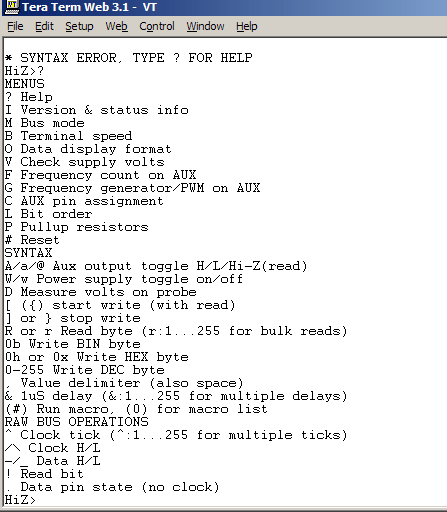

# Basic Commands

## Get to know the terminal interface {#get_to_know_the_terminal_interface}

The Bus Pirate is controlled by text commands entered through the serial
terminal. If the terminal is blank, press *enter* to show the command
prompt. Press '?', followed by *enter*, to show the help menu.

-   **Menus** configure various Bus Pirate options like pull-up
    resistors, terminal speed, data display format (DEC, HEX, BIN), etc.
    Type the menu command, followed by *enter*, to display the options.
-   **Syntax** is used to interact with a device connected over a bus.
    Commands are mostly single characters, such as 'r' to read a byte.
    Enter up to 4000 characters of syntax, press *enter* to execute the
    sequence.

Each menu and syntax option is documented fully in the [Bus Pirate
manual](http://dangerousprototypes.com/bus-pirate-manual/).

Most menus have a default option shown in () before the prompt:
`<nl2br>`{=html}Output type: 1. High-Z outputs (H=input, L=GND) 2.
Normal outputs (H=Vcc, L=GND) (1) \>
``{=html}**\<\<\< option 1 is
the default**``{=html}`</nl2br>`{=html} Press *enter* to select
the default option.

## Bus modes, protocol libraries {#bus_modes_protocol_libraries}

`<nl2br>`{=html}HiZ\>M
``{=html}**\<\<\< bus mode
menu**``{=html} 1. HiZ 2. 1-WIRE 3. UART 4. I2C 5. SPI 6. JTAG 7.
RAW2WIRE 8. RAW3WIRE 9. PC KEYBOARD 10. MIDI 11. LCD (1) \>5
**``{=html}\<\<\< enter SPI
bus mode``{=html}**`</nl2br>`{=html} The \'bus mode\' menu (M)
configures the Bus Pirate for a specific protocol, like 1-Wire, I2C,
SPI, etc. The default start-up mode is HiZ, all pins are inputs and all
power supplies are off.

Most modes have additional options, like [open drain
outputs](http://hackaday.com/2009/07/01/mixed-voltage-interfacing-with-the-bus-pirate/)
or speed settings. Each bus mode is documented in the [Bus Pirate
manual](http://dangerousprototypes.com/bus-pirate-manual/).
`<nl2br>`{=html}SPI READY SPI\>p
``{=html}**\<\<\< pull-up
configuration menu**``{=html} 1. Pullup off 2. Pullup on (1) \>2
``{=html}**\<\<\< pull-up
on**``{=html} PULLUP RESISTORS ON SPI\>W
``{=html}**\<\<\< power
supplies ON syntax**``{=html} POWER SUPPLIES ON SPI\>v
``{=html}**\<\<\< check power
supply output**``{=html} VOLTAGE MONITOR: 5V: 4.9 \| 3.3V: 3.3 \|
VPULLUP: 0.0 \| SPI\>`</nl2br>`{=html} Once a mode is configured, you
can enable other options. Turn on the on-board voltage regulators
(capital \'W\') and check the output levels (v). Configure the [pull-up
resistors](Practical_guide_to_Bus_Pirate_pull-up_resistors "wikilink")
(p).

## Taking it further {#taking_it_further}

Now might be a good time to run a [hardware
self-test](Self-test_guide "wikilink") and update to the latest firmware
([Windows](http://dangerousprototypes.com/2009/07/24/bus-pirate-firmware-upgrades/),
[OSX](http://dangerousprototypes.com/2009/10/24/bus-pirate-firmware-updates-on-osx/),
[Python](http://dangerousprototypes.com/2009/08/06/bus-pirate-firmware-upgrades-on-linux-osx/)).

For lots of device demonstrations, and to learn more about the Bus
Pirate syntax, menus, pinout, modes, and more, check the [Bus Pirate
manual](http://dangerousprototypes.com/bus-pirate-manual/) and the [Bus
Pirate forum](http://whereisian.com/forum/index.php?board=4.0).
