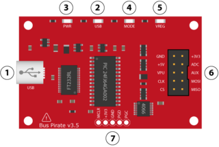
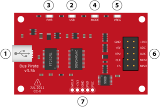
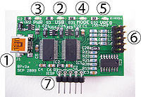
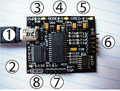

# Hardware Features

SOIC Version

Last Version

Older Version(s)

*1. Mini-B USB port.* Connects the Bus Pirate to a PC. The Bus Pirate
draws power from the USB port, and uses the data connection to
communicate with the PC.

*2. USB transmit indicator.* This LED flashes when there's traffic from
the PIC to the PC.

*3. Power indicator.* This LED lights when the Bus Pirate is powered by
the USB supply.

*4. Mode indicator.* This LED lights when the Bus Pirate is configured
for a protocol mode from the user terminal (menu 'm'). The I/O pins
might be active when the mode indicator is on. The pins should be in a
safe, non-powered, high-impedance state when the mode LED is off.

*5. Voltage regulator indicator.* This LED lights when the on-board
power supplies have been activated from the user terminal (command
capital 'W' ).

*6. I/O pins.* This 2x5 block of 0.1" pin header connects the Bus
Pirate to external circuits. See the pinout table below, or the [Bus
Pirate manual](http://dangerousprototypes.com/bus-pirate-manual/).

## IO pins

| Pin Name          | Description (Bus Pirate is the master)                   |
|-------------------|----------------------------------------------------------|
| MOSI | Master data out, slave in (SPI, JTAG), Serial data (1-Wire, I2C, KB), TX* (UART) |
| CLK               | Clock signal (I2C, SPI, JTAG, KB)                        |
| MISO              | Master data in, slave out (SPI, JTAG) RX (UART)          |
| CS*               | Chip select (SPI), TMS (JTAG)                            |
| AUX               | Auxiliary IO, frequency probe, pulse-width modulator     |
| ADC               | Voltage measurement probe (max 6volts)                   |
| Vpu               | Voltage input for on-board pull-up resistors (0-5volts). |
| +3.3v             | +3.3volt switchable power supply                         |
| +5.0v             | +5volt switchable power supply                           |
| GND               | Ground, connect to ground of test circuit                |

*Notes: TX moved from CS to MOSI in firmware v0g*

*7. In circuit serial programming (ICSP) header.* This 1x5 block of
0.1" pin header is the programming connection for the PIC 24FJ64GA002
microcontroller. These pins can be used to write new firmware to the
microcontroller with a programmer like the PICKIT2 or ICD2 . The Bus
Pirate firmware can also be updated over the USB connection using a
bootloader, so the ICSP header is normally only used to program it the
first time at the factory. Put a jumper between the PGC and PGD pins to
trigger the on-board bootloader for firmware updates.

*8. Serial terminal (ST) header.* *Version v2go only*. This unpopulated
header is a tap into the UART connection between the PIC microcontroller
and the FTDI 232BL chip that provides the USB connection. The Bus Pirate
firmware defaults to a 115200bps/8/N/1 UART.

## Power Supply

3.3volt and 5volt on-board power supplies can provide up to 150mA for
your project. Activate them with the w/W command from any mode
`<u>`{=html}except HiZ mode`</u>`{=html}. HiZ mode is a safe mode and
all outputs are disabled.
`<nl2br>`{=html}I2C\>w``{=html}**\<\<\<power
supplies off**``{=html} POWER SUPPLIES OFF
I2C\>v``{=html}**\<\<\<voltage
report**``{=html} Voltage monitors: 5V: 0.0 \| 3.3V: 0.0 \|
VPULLUP: 0.0 \|
I2C\>W``{=html}**\<\<\<power
supplies on**``{=html} POWER SUPPLIES ON
I2C\>v``{=html}**\<\<\<voltage
monitor report**``{=html} Voltage monitors: 5V: 4.9 \| 3.3V: 3.2
\| VPULLUP: 0.0 \| I2C\>`</nl2br>`{=html} Capital \'W\' activates the
on-board supplies, small \'w\' turns them off. Turn the power supplies
on, then press v to show a power supply voltage report.

Note that W is syntax and not a menu option, it can be used with other
syntax to toggle the power in the middle of complex bus operations.

The power supplies will try to protect your project with over current
protection. Additionally, the Bus Pirate will measure the voltage
shortly after the supplies are enabled. If a short is detected it will
disable them and show a warning. This may help minimize damage to a
project when there is a short or problem on a new board.

### Output
### Limit
## Pull-up Resistors

Some bus types, such as I2C, require a resistor to create a \'1\' on the
bus. This is called an [open collector or open drain
bus](http://hackaday.com/2009/07/01/mixed-voltage-interfacing-with-the-bus-pirate/).
Without a [pull-up
resistor](http://en.wikipedia.org/wiki/Pull-up_resistor), the bus will
only read \'0\'. Some bus modes are open collector only (1-Wire, I2C),
most have an open collector option. `<nl2br>`{=html}I2C\>v
``{=html}**\<\<\<voltage
monitor report**``{=html} Voltage monitors: 5V: 4.9 \| 3.3V: 3.2
\| VPULLUP: 4.9 \| I2C\>`</nl2br>`{=html} Connect the Vpu pin of the IO
header to a voltage. The on-board pull-up resistors apply the voltage
connected to the Vpu pin to the bus pins through 10Kohm resistors. Press
v and verify that the Vpullup voltage shows the desired value.
`<nl2br>`{=html}I2C\>p
``{=html}**\<\<\<configure
pull-up resistors**``{=html} 1. Pull-ups off 2. Pull-ups on (1)
\>2 ``{=html}**\<\<\<enable**
``{=html}Pull-up resistors ON I2C\>`</nl2br>`{=html} Press p to
configure the on-board pull-up resistors, enable them. For more, see the
[practical guide to Bus Pirate pull-up
resistors](Practical_guide_to_Bus_Pirate_pull-up_resistors "wikilink").